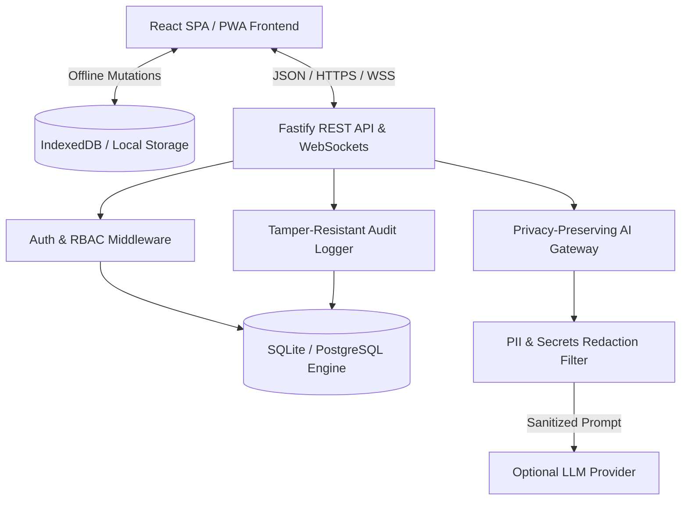
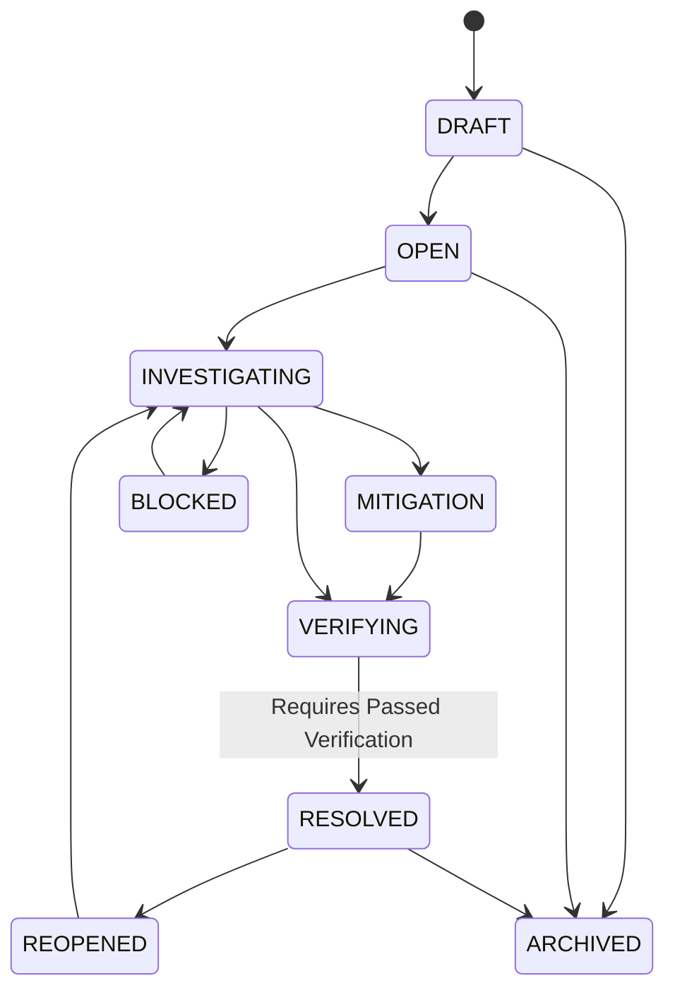

# ResolveOS — System Architecture Documentation

## 1. High-Level Architecture Overview

ResolveOS is architected as a **privacy-first, local-first distributed problem-resolution system** operating across clear trust boundaries.

---

## 2. Monorepo Package Breakdown

| Package / App | Description | Primary Dependencies |
|---|---|---|
| `@resolveos/shared` | Core domain interfaces, enums, DTOs, API event contracts | Zero dependencies |
| `@resolveos/domain` | Case state machine, Problem quality scorer, 5-Whys, Solution matrix | `@resolveos/shared` |
| `@resolveos/validation` | Full Zod validation schemas for all requests, mutations & exports | `zod`, `@resolveos/shared` |
| `@resolveos/security` | Cryptographic primitives, scrypt hashing, TOTP 2FA, PII redaction, SSRF guard | Node `crypto` |
| `@resolveos/database` | Database storage engine, schema indices, query builders | `@resolveos/shared` |
| `@resolveos/api` | Fastify backend server, WebSockets, Audit trail, Privacy & AI routes | `fastify`, `@fastify/jwt`, `dotenv` |
| `@resolveos/web` | React 18 SPA + PWA, Zustand stores, TanStack Query, Three.js 3D network | `react`, `zustand`, `three`, `tailwindcss` |

---

## 3. Case State Machine & Invariant Transitions

Case progression is strictly validated on both client and server:

---

## 4. Offline Synchronization Protocol

1. When network connectivity drops, mutations (case edits, evidence attachments, action completions) are queued locally with client timestamps.
2. When connectivity restores, `OfflineSyncManager` executes atomic sequential replay against `/api`.
3. If an entity was updated concurrently by another user, the server responds with HTTP 409 Conflict.
4. `ConflictResolver` applies field-level non-destructive 3-way merging and surfaces conflicting fields to the UI for operator review.
