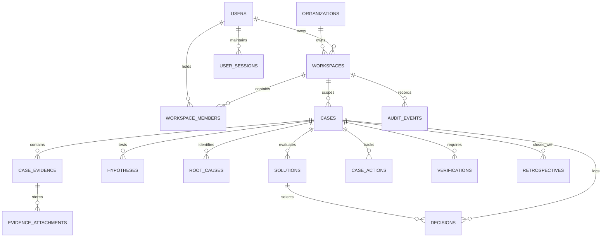

# ResolveOS — Production Database Architecture & Operations Guide

## 1. Database Overview

ResolveOS utilizes **PostgreSQL (14+)** as its canonical production database engine. For local development, isolated integration tests, and zero-dependency CI runs, an in-memory transactional driver conforming to the exact same contract is provided.

```text
                               Application Services
                                        ↓
                                 DatabaseDriver
                                        │
             ┌──────────────────────────┴──────────────────────────┐
             ▼                                                     ▼
     PostgresDatabase                                         MemoryStore
(PostgreSQL 14+ with pg.Pool)                         (In-memory / Local File)
- Strict Foreign Keys                                 - Snapshot Rollback
- Schema Migrations                                   - Zero Native C++ Compiles
- ACID Transactions                                   - Fast Unit Testing
- Connection Pooling
```

---

## 2. Relational Schema & Entity Relationships

The schema is defined in `packages/database/migrations/0001_initial_schema.sql` and `packages/database/src/schema.ts`.



---

## 3. Production Connection Pooling & Limits

PostgreSQL connection pooling is configured via environment variables in `packages/database/src/index.ts`:

| Configuration Variable | Default | Purpose |
|---|---|---|
| `DATABASE_URL` | None (Required for Postgres) | PostgreSQL connection URI |
| `PG_POOL_MAX` | `20` | Maximum concurrent pooled client connections |
| Idle Timeout | `30,000 ms` | Milliseconds before an idle connection is reclaimed |
| Connection Timeout | `5,000 ms` | Milliseconds before connection acquisition aborts |

---

## 4. Transaction Boundaries & Atomicity

All multi-step state mutations must be wrapped in `db.transaction(async (tx) => ...)`:

```typescript
await db.transaction(async (tx) => {
  // 1. Verify acceptance criteria
  // 2. Update case status to RESOLVED
  // 3. Log audit event
  // If any operation throws, the transaction rolls back automatically
});
```

---

## 5. Automated Migrations

Migrations are stored in `packages/database/migrations/` and executed atomically against a dedicated `_migrations` tracking table:

```bash
# Execute migrations manually or during container startup
node -e "import('@resolveos/database').then(m => m.getDatabase().migrate())"
```

---

## 6. Backup & Disaster Recovery Strategy

### Automated Logical Backups (pg_dump)
```bash
# Nightly compressed custom-format backup
pg_dump -Fc -h postgres -U resolveos_user -d resolveos > /backups/resolveos_$(date +%Y%m%d_%H%M%S).dump
```

### Restore Runbook
```bash
# Restore from dump with transaction safety
pg_restore -c -h postgres -U resolveos_user -d resolveos /backups/resolveos_latest.dump
```
